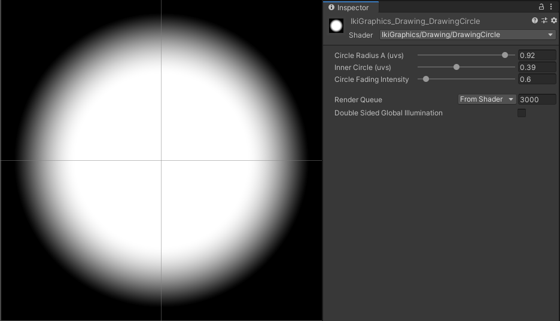
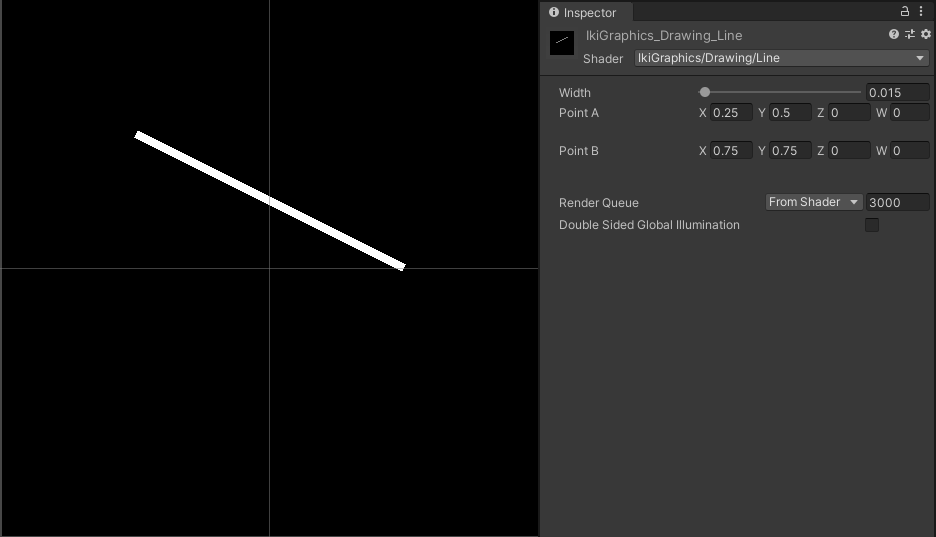

# Shape Shaders

> A collection of shaders representing shapes for textures in [Unity](https://unity.com/).

This repository contains a collection of shaders for [Unity](https://unity.com/) that represent shapes on a quad. You can use the code to create mask with them so you'll get more complex shapes like houses, characters, cars, vfx, ...

## Index

- Shaders
    - [atan](#atan)
    - [capsule](#capsule)
    - [circle](#circle)
    - [circleGradient](#circleGradient)
    - [circleLinearGradient](#circleLinearGradient)
    - [cross](#cross)
    - [customTile](#customTile)
    - [diagonalTriangles](#diagonalTriangles)
    - [ditheringShade](#ditheringShade)
    - [drawingBoxSelector](#drawingBoxSelector)
    - [drawingCircle](#drawingCircle)
    - [drawingLine](#drawingLine)
    - [drawingTorus](#drawingTorus)
    - [ellipse](#ellipse)
    - [fadingCircle](#fadingCircle)
    - [fadingEllipse](#fadingEllipse)
    - [fadingHLine](#fadingHLine)
    - [fadingVLine](#fadingVLine)
    - [gradientH](#gradientH)
    - [gradientV](#gradientV)
    - [grid](#grid)
    - [haloStar](#haloStar)
    - [horizontalLines](#horizontalLines)
    - [line](#line)
    - [lineFromCenter](#lineFromCenter)
    - [multiRing](#multiRing)
    - [polygon](#polygon)
    - [pyramid](#pyramid)
    - [ring](#ring)
    - [roundedRectangle](#roundedRectangle)
    - [sliceUvs](#sliceUvs)
    - [star](#star)
    - [spermatozoid](#spermatozoid)

## Shaders

### [atan](#atan)

### [capsule](#capsule)

### [circle](#circle)

### [circleGradient](#circleGradient)

### [circleLinearGradient](#circleLinearGradient)

### [cross](#cross)

### [customTile](#customTile)

### [diagonalTriangles](#diagonalTriangles)

### [ditheringShade](#ditheringShade)

### [drawingBoxSelector](#drawingBoxSelector)

### [drawingCircle](#drawingCircle)

### [drawingLine](#drawingLine)

### [drawingTorus](#drawingTorus)

### [ellipse](#ellipse)

### [fadingCircle](#fadingCircle)

### [fadingEllipse](#fadingEllipse)

### [fadingHLine](#fadingHLine)

### [fadingVLine](#fadingVLine)

### [gradientH](#gradientH)

### [gradientV](#gradientV)

### [grid](#grid)

### [haloStar](#haloStar)

### [horizontalLines](#horizontalLines)

### [line](#line)

### [lineFromCenter](#lineFromCenter)

### [multiRing](#multiRing)

### [polygon](#polygon)

### [pyramid](#pyramid)

### [ring](#ring)

### [roundedRectangle](#roundedRectangle)

### [sliceUvs](#sliceUvs)

### [star](#star)

### [spermatozoid](#spermatozoid)

This one is an easter egg one to show some animation tricks.
